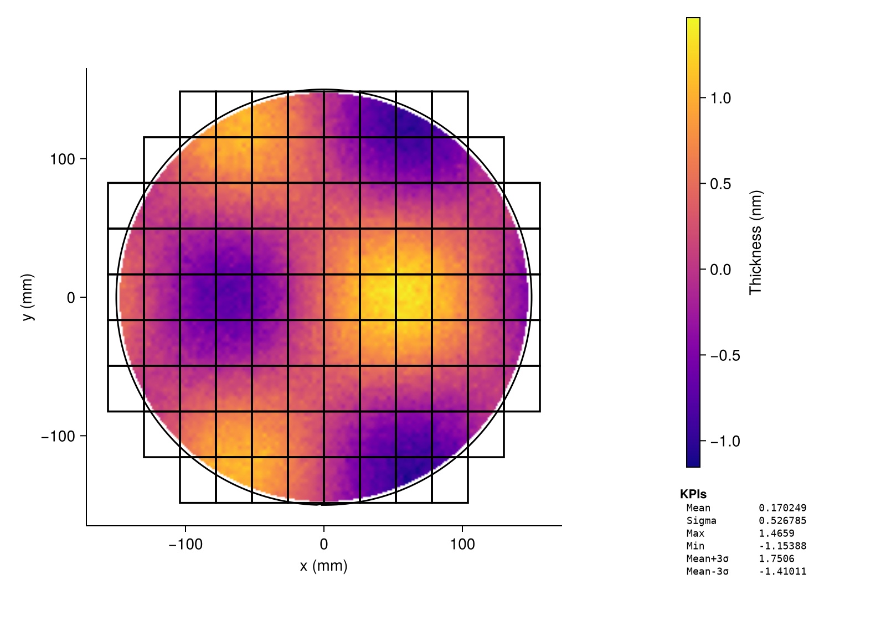

# LithoWaferPlots.jl {#LithoWaferPlots.jl}

Open-source semiconductor wafer map visualization for Julia.





## Quick start {#Quick-start}

```julia
using LithoWaferPlots
using CairoMakie          # or GLMakie / WGLMakie

wafer = WaferSpec(300.0)  # 300mm wafer, notch at bottom (270°)

# x, y in mm from wafer centre; value is your measurement
data = WaferData(my_table, wafer)

fig, ax, side = wafer_figure()
p = waferheatmap!(ax, data; colormap=:plasma)
add_colorbar!(side, p; label="Thickness (nm)")
add_kpi_panel!(side, data)
display(fig)
```


## Features {#Features}
- **Seven plot types** — scatter, heatmap, contour, arrows, streamlines, divergence, vorticity
  
- **Field and die overlays** — rectangular exposure-field boundaries on any plot
  
- **KPI panel** — built-in metrics (mean, sigma, min/max, P99, ±3σ) with a simple extension contract
  
- **Any tabular input** — DataFrames, NamedTuples, CSV rows, or plain arrays via Tables.jl
  
- **mm and die-index coordinates** — automatic column/row → mm conversion via `DieGrid`
  
- **Fast rendering** — `image!` GPU texture path for dense heatmaps (&gt;5 000 points); target 300 000 pts &lt; 0.3 s on GLMakie
  
- **Backend-agnostic** — CairoMakie, GLMakie, and WGLMakie all supported; Makie is a weak dependency
  

## Sources {#Sources}

This package is built entirely from free, open resources:

|                                                                                                   Source |  License |                          Use |
| --------------------------------------------------------------------------------------------------------:| --------:| ----------------------------:|
|                                                  [cap1tan/wafermap](https://github.com/cap1tan/wafermap) |      MIT |     Notch geometry reference |
|                                          [dougthor42/wafer_map](https://github.com/dougthor42/wafer_map) |      MIT |             SEMI wafer sizes |
|                                                            [xlhaw/wfmap](https://github.com/xlhaw/wfmap) |      MIT |    Heatmap binning reference |
|                          [Wikipedia: Substrate mapping](https://en.wikipedia.org/wiki/Substrate_mapping) | CC BY-SA |              Domain overview |
| [Artwork Systems glossary](https://www.artwork.com/package/wmapconvert/manual_v2/glossary_of_terms.html) |   Public | Notch/coordinate conventions |
|                                                                     SEMI M20 / M21 (public descriptions) |   Public |  Coordinate & die addressing |

