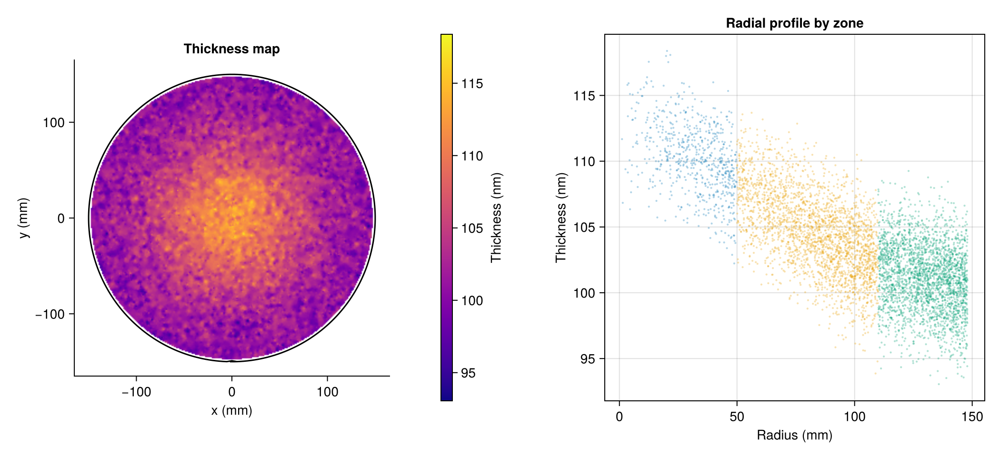

# Compositing with AlgebraOfGraphics

LithoWaferPlots handles the spatial view of wafer data. For the analytical side —
grouping, faceting, statistical overlays — [AlgebraOfGraphics.jl](https://aog.makie.org)
(AoG) is a natural complement. Because AoG uses the same Makie `Figure` and grid layout,
the two can share a single figure with no adapter code.

## When to use each

| Task | Tool |
|---|---|
| Spatial wafer map | `waferheatmap!`, `waferscatter!`, `wafercontour!` |
| Multi-wafer spatial grid | `wafer_facet` |
| Radial profile, lot scatter, violin/box by group | AlgebraOfGraphics |
| Mixed figure (map + statistics) | Both in one `Figure` |

## Combined figure: wafer map + radial profile

The key call is `draw!(fig[row, col], aog_layer)` — AoG draws into a specific grid
position of an existing `Figure`, right next to a LithoWaferPlots panel.

```julia
using LithoWaferPlots, CairoMakie, AlgebraOfGraphics, DataFrames

wafer = WaferSpec(300.0)

# Classify each measurement into a radial zone
zone = ifelse.(r .< 50, "Center", ifelse.(r .< 110, "Middle", "Edge"))

wdata = WaferData((x = x, y = y, value = thickness), wafer)
df = DataFrame(r = r, thickness = thickness, zone = zone)

fig = Figure(size = (1050, 480))

# ── Left: wafer heatmap (LithoWaferPlots) ────────────────────────────────
gl = fig[1, 1] = GridLayout()
ax = Axis(gl[1, 1]; aspect = DataAspect(), title = "Thickness map",
          xgridvisible = false, ygridvisible = false,
          topspinevisible = false, rightspinevisible = false,
          xlabel = "x (mm)", ylabel = "y (mm)")
p = waferheatmap!(ax, wdata; colormap = :plasma)
cb_side = gl[1, 2] = GridLayout()
add_colorbar!(cb_side, p; label = "Thickness (nm)")
colsize!(gl, 2, Relative(0.2))
colsize!(fig.layout, 1, Relative(0.52))

# ── Right: radial profile by zone (AlgebraOfGraphics) ────────────────────
zone_ord = sorter("Center", "Middle", "Edge")
aog_plt = data(df) *
    mapping(:r => "Radius (mm)", :thickness => "Thickness (nm)";
            color = :zone => zone_ord => "Zone") *
    visual(Scatter; markersize = 3, alpha = 0.3)
draw!(fig[1, 2], aog_plt; axis = (title = "Radial profile by zone",))
```



## Lot-level comparison with AoG faceting

For comparing multiple lots statistically — without needing the spatial map —
AoG's `layout` mapping creates a panel grid automatically from any grouped table.

```julia
# df has columns: lot, r, thickness
lot_plt = data(df) *
    mapping(:r => "Radius (mm)", :thickness => "Thickness (nm)";
            color = :lot, layout = :lot) *
    visual(Scatter; markersize = 3, alpha = 0.4)

draw(lot_plt; axis = (title = "Radial profile",))
```

For the full spatial view of each lot, use `wafer_facet` (see [Gallery](@ref)).
The two approaches are complementary: `wafer_facet` shows *where* values are on
the wafer; AoG faceting shows *how the distributions compare* across lots.

## Violin plot of zone distributions

```julia
zone_violin = data(df) *
    mapping(:zone => sorter("Center", "Middle", "Edge"),
            :thickness => "Thickness (nm)";
            color = :zone) *
    visual(Violin)

draw(zone_violin; axis = (xlabel = "Zone", title = "Thickness distribution"))
```

## Layout tips

- `draw!(fig[r, c], plt)` places an AoG layer at grid position `(r, c)` of an existing `Figure`.
- `draw!(fig[r, c], plt; axis = (...))` passes keyword arguments to the underlying `Axis`.
- `colsize!(fig.layout, col, Relative(0.5))` controls the width split between panels.
- AoG's automatic legend is attached to the `AxisGrid` returned by `draw!` — it appears inside the AoG panel, not next to the wafer map.
