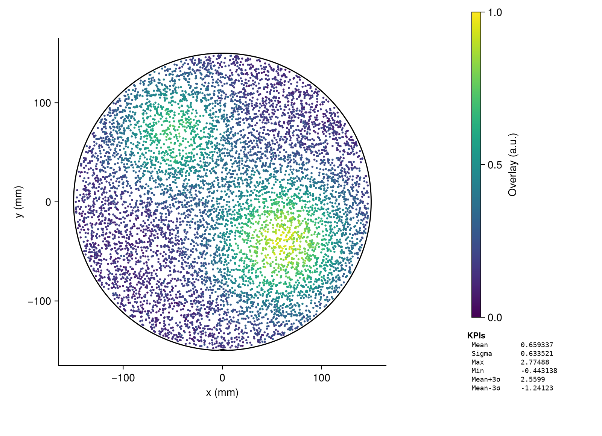
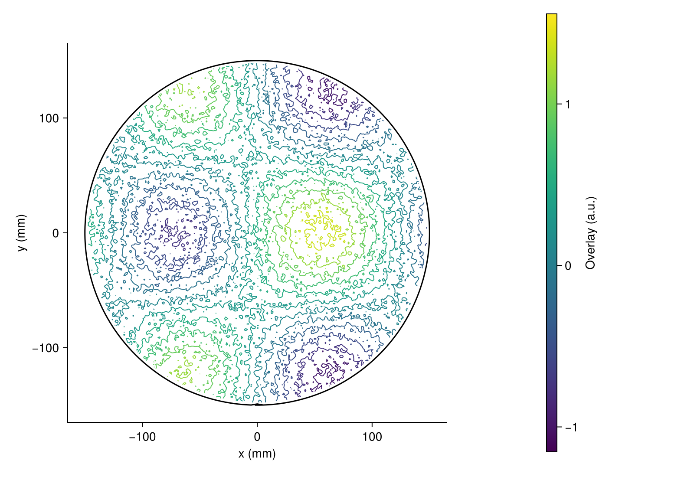
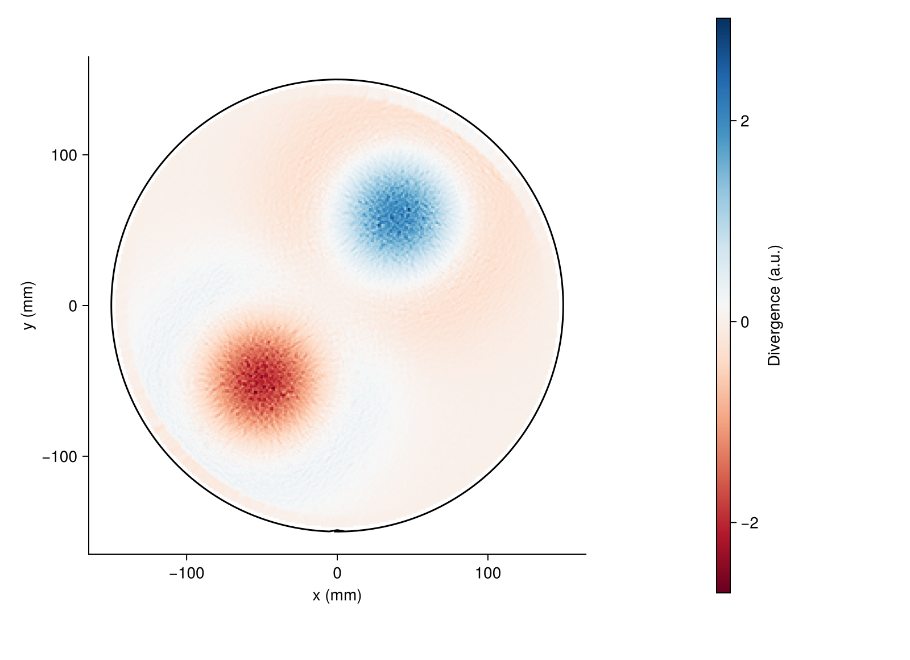
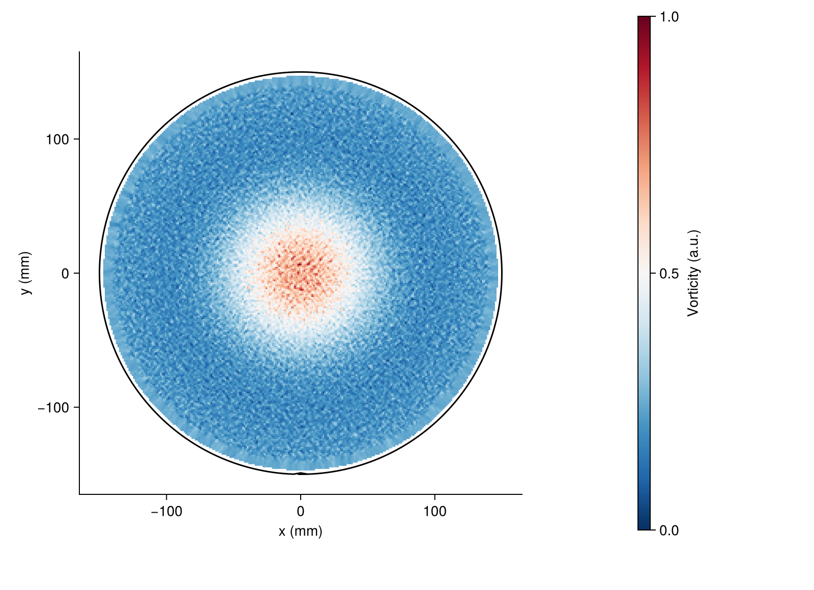
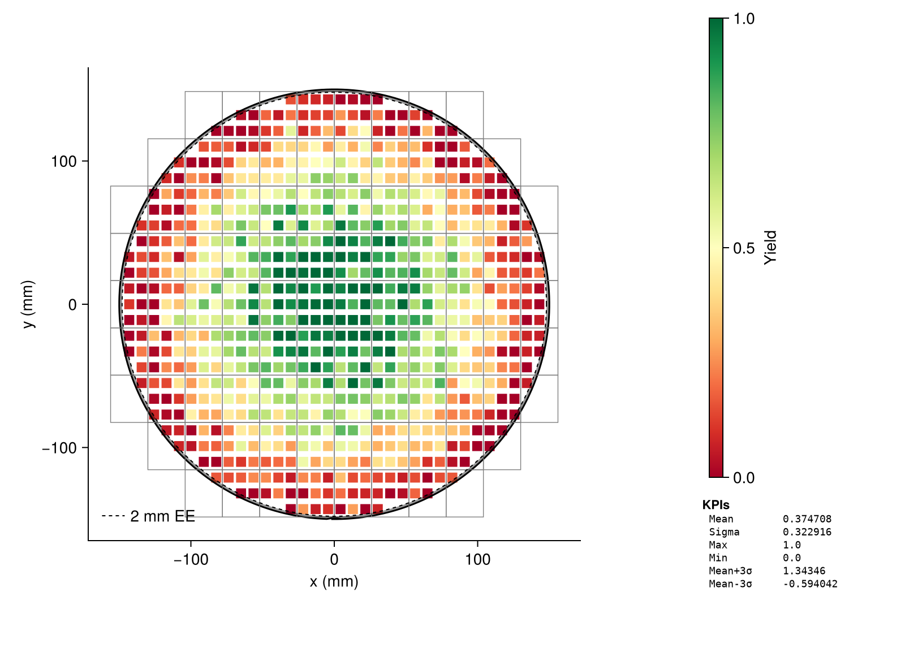
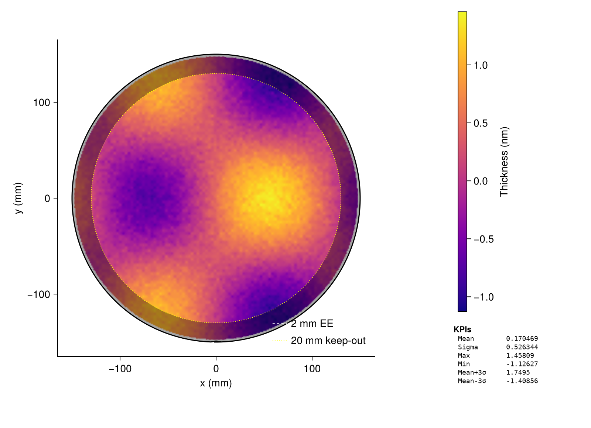
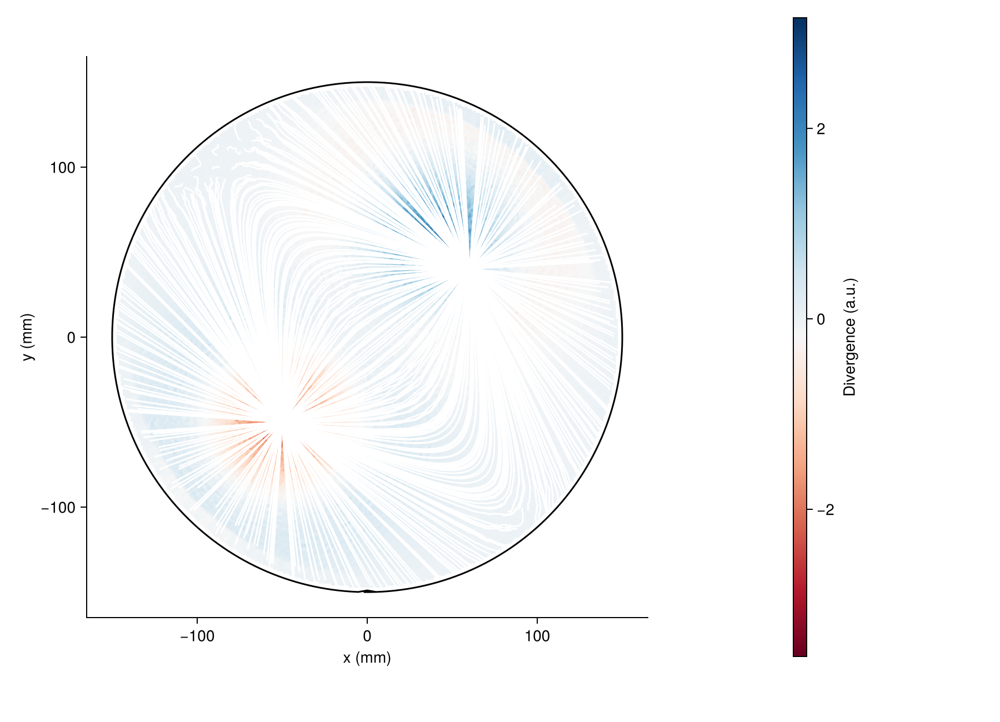
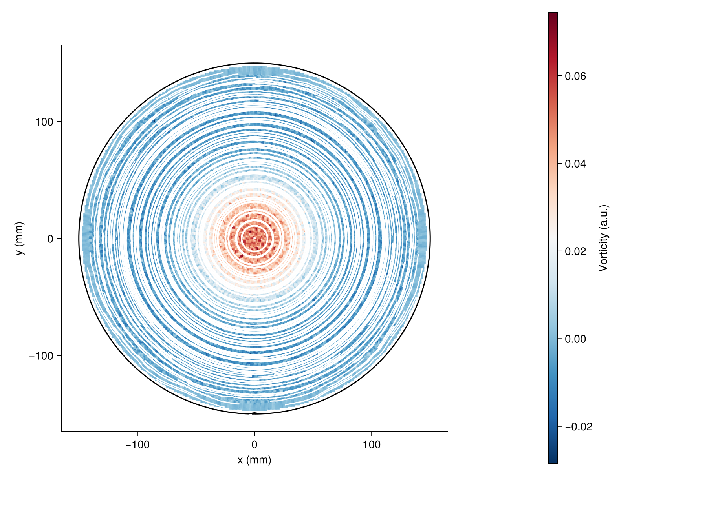

# Gallery

All plots use CairoMakie. Swap in `GLMakie` for interactive desktop windows or `WGLMakie` for Jupyter/Pluto notebooks.

## Scatter

Sparse measurement points coloured by value. Good for raw probe data where point density is uneven.

```julia
fig, ax, side = wafer_figure()
p = waferscatter!(ax, data; markersize=4f0)
add_colorbar!(side, p; label="Overlay (a.u.)")
add_kpi_panel!(side, data)
```



---

## Heatmap

Dense rectangular markers produce a filled colour map. For datasets with more than 5 000 points the recipe automatically switches to an `image!` GPU texture path for faster rendering. `percentile_clip` removes colour-scale distortion from outliers.

```julia
fig, ax, side = wafer_figure()
p = waferheatmap!(ax, data; colormap=:plasma)
add_colorbar!(side, p; label="Thickness (nm)")
add_kpi_panel!(side, data)
```

For a large regular-grid dataset (> 5 000 points), the recipe uses `imagemode=:image` automatically. Override with `imagemode=:scatter` or `imagemode=:image` explicitly.


---

## Heatmap with field overlay

Pass a `fields` vector to `WaferData` to overlay exposure-field or die boundaries on any plot type. Fields may extend beyond the wafer edge.

```julia
fw, fh = 26.0, 33.0
r = wafer.diameter_mm / 2.0

# 12 columns × 9 rows grid; drop fields that lie completely outside the wafer disk
all_fields = vec([WaferField((ci - 0.5)*fw, (ri - 5)*fh, fw, fh, ci, ri)
                  for ri in 1:9, ci in -5:6])
fields = filter(all_fields) do f
    hw, hh = fw/2, fh/2
    nx = clamp(0.0, f.x_center_mm - hw, f.x_center_mm + hw)
    ny = clamp(0.0, f.y_center_mm - hh, f.y_center_mm + hh)
    nx^2 + ny^2 <= r^2
end

data = WaferData(table, wafer; fields=fields)

fig, ax, side = wafer_figure()
p = waferheatmap!(ax, data; colormap=:plasma,
                  field_color=(:black, 0.0),
                  field_strokecolor=:black, field_strokewidth=1.8f0)
add_colorbar!(side, p; label="Thickness (nm)")
add_kpi_panel!(side, data)
```


---

## Contour

Scattered data is interpolated to a regular grid via IDW before contouring. Adjust `grid_n` (default 256) and `levels` as needed.

```julia
fig, ax, side = wafer_figure()
p = wafercontour!(ax, data; levels=12, colormap=:viridis)
add_colorbar!(side, p; label="Overlay (a.u.)")
```



---

## Arrows

Arrow plot of a vector field. Subsampled to `max_arrows` (default 20 000) for legibility. Scale arrows with `lengthscale`.

```julia
fig, ax, side = wafer_figure()
waferarrows!(ax, vdata; lengthscale=8.0, arrowcolor=:steelblue)
```


---

## Streamlines

RK4-traced stream lines from a uniform seed grid. Controls: `n_seeds`, `max_steps`, and `step_size`.

```julia
fig, ax, side = wafer_figure()
waferstreamlines!(ax, vdata; n_seeds=12, max_steps=80,
                  color=:navy, linewidth=1.2f0)
```


---

## Divergence

∇·**v** = ∂vx/∂x + ∂vy/∂y, computed by IDW interpolation to a regular grid then central finite differences. A diverging colormap (`:RdBu`) centres the colour scale on zero.

```julia
fig, ax, side = wafer_figure()
p = waferdivergence!(ax, vdata; colormap=:RdBu)
add_colorbar!(side, p; label="Divergence (a.u.)")
```



---

## Vorticity

∇×**v** = ∂vy/∂x − ∂vx/∂y. Positive values (red) indicate counterclockwise rotation; negative (blue) indicate clockwise.

```julia
fig, ax, side = wafer_figure()
p = wafervorticity!(ax, vdata)
add_colorbar!(side, p; label="Vorticity (a.u.)")
```



---

## Die-level yield map

Per-die yield across ~100 exposure fields (3×3 = 9 dies each). Field boundaries are
overlaid as thin gray strokes. The 2 mm edge-exclusion ring dims the outer annulus
where yield data is typically not trusted.

```julia
fw, fh = 26.0, 33.0
die_w, die_h = fw / 3, fh / 3

# build die centres and yield values from field list
x, y, v = Float64[], Float64[], Float64[]
for f in fields
    for di in 0:2, dj in 0:2
        cx = f.x_center_mm - fw/2 + (di + 0.5) * die_w
        cy = f.y_center_mm - fh/2 + (dj + 0.5) * die_h
        push!(x, cx); push!(y, cy)
        push!(v, my_yield_value(cx, cy))   # 0–1
    end
end

data = WaferData((x=x, y=y, value=v), wafer; fields=fields)

fig, ax, side = wafer_figure()
p = waferheatmap!(ax, data; markersize=14f0, colormap=:RdYlGn,
                  field_color=(:black, 0.0),
                  field_strokecolor=:gray50, field_strokewidth=0.7f0)
add_colorbar!(side, p; label="Yield")
add_kpi_panel!(side, data)
add_exclusion_ring!(ax, wafer; mm_to_edge=2.0, label="2 mm EE",
                    color=:black, linestyle=:dash, dim_outside=true, dim_alpha=0.4)
add_ring_legend!(ax; position=:lb)
```



---

## Exclusion ring annotation

Draw dashed/dotted radial exclusion rings on any plot, specified as **mm to the edge**
(the natural fab unit). Optionally dim the region outside the ring with a semi-transparent
overlay that works with every recipe type including image-mode heatmaps and CFD plots.

```julia
fig, ax, side = wafer_figure()
p = waferheatmap!(ax, data; colormap = :plasma)
add_colorbar!(side, p; label = "Thickness (nm)")
add_kpi_panel!(side, data)

# inner ring — dashed white line only
add_exclusion_ring!(ax, wafer; mm_to_edge = 2.0,
    label = "2 mm EE", color = :white, linestyle = :dash)

# outer ring — dotted + dim the annular region outside it
add_exclusion_ring!(ax, wafer; mm_to_edge = 20.0,
    label = "20 mm keep-out", color = :yellow, linestyle = :dot,
    dim_outside = true, dim_alpha = 0.35)

add_ring_legend!(ax; position = :rb)
```



---

## CFD Combined: Divergence + Streamlines

The standard CFD summary view: ∇·**v** heatmap as background, streamlines overlaid in white.
`wafer_cfd_figure` handles the layout and prevents the wafer boundary from being drawn twice.

```julia
fig, ax, side = wafer_cfd_figure(vdata;
    scalar = :divergence,
    vector = :streamlines,
    streamline_color = :white,
    n_seeds = 25,
)
```



---

## CFD Combined: Vorticity + Streamlines

Rotation intensity as background with streamlines showing the flow direction simultaneously.

```julia
fig, ax, side = wafer_cfd_figure(vdata;
    scalar = :vorticity,
    vector = :streamlines,
    streamline_color = :white,
    n_seeds = 25,
)
```



### Manual composition

For full control use `draw_boundary=false` on the overlay recipe:

```julia
fig, ax, side = wafer_figure()
p = waferdivergence!(ax, vdata; colormap = :RdBu)
waferstreamlines!(ax, vdata; draw_boundary = false, draw_fields = false,
                  color = :white, n_seeds = 30)
add_colorbar!(side, p; label = "∇·v (a.u.)")
```

The same `draw_boundary` and `draw_fields` keywords are available on every recipe,
so any combination (e.g. contour + scatter overlay) is possible without duplicate boundaries.
