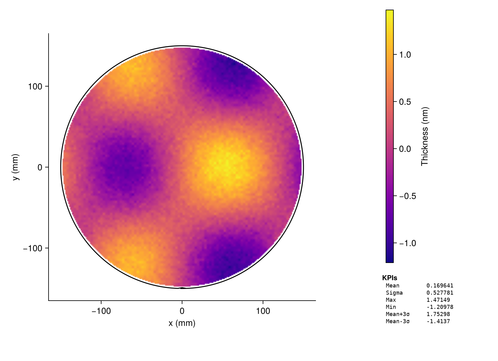
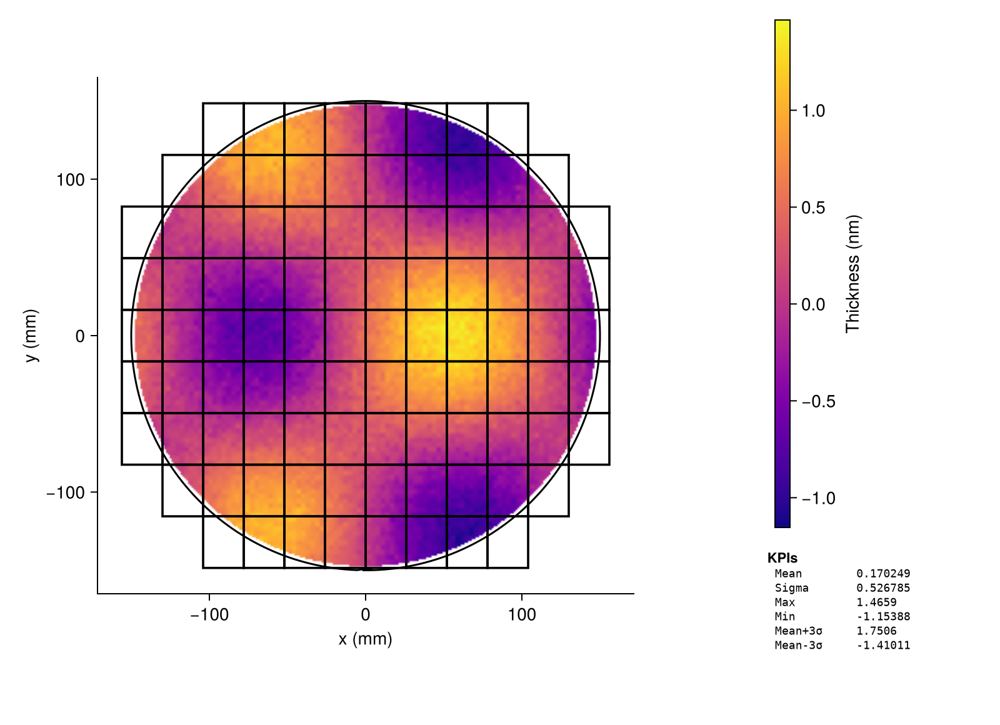
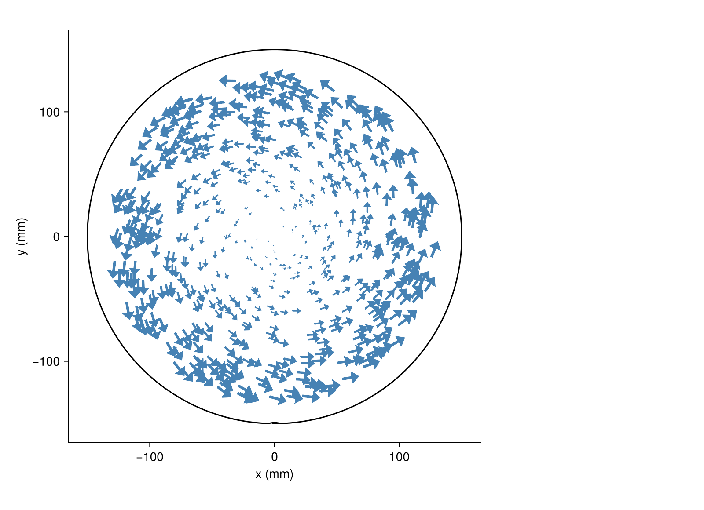
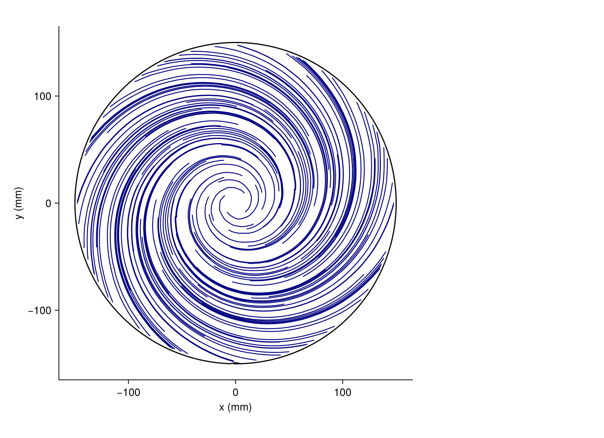

# Getting Started

## Installation

```julia
using Pkg
Pkg.add(url="https://github.com/el-oso/LithoWaferPlots.jl")
```

Add a Makie backend for rendering (GLMakie for desktop, WGLMakie for notebooks):

```julia
Pkg.add("GLMakie")
```

## Step 1 — Define the wafer

```julia
using LithoWaferPlots

wafer = WaferSpec(300.0)          # 300mm diameter, default notch at 270° (bottom)
wafer = WaferSpec(200.0, 90.0)    # 200mm, notch at 3 o'clock
```

## Step 2 — Load measurement data

### From a DataFrame (mm coordinates)

```julia
using DataFrames
df = DataFrame(x=meas_x, y=meas_y, value=meas_v)
data = WaferData(df, wafer)
```

### From die indices

```julia
grid = DieGrid(-75.0, -75.0, 5.0, 5.0)   # origin mm, die pitch mm
df = DataFrame(col=col_idx, row=row_idx, value=vals)
data = WaferData(df, grid, wafer)
```

### From plain arrays

```julia
data = WaferData((x=xs, y=ys, value=vs), wafer)
```

## Step 3 — Plot

```julia
using GLMakie

fig, ax, side = wafer_figure()
p = waferheatmap!(ax, data)
add_colorbar!(side, p; label="Overlay (a.u.)")
add_kpi_panel!(side, data)
display(fig)
```



## Step 4 — Add field overlays

Pass a `fields` vector when constructing `WaferData` to overlay rectangular
exposure fields on any plot type.

```julia
fw, fh = 26.0, 33.0
r = wafer.diameter_mm / 2.0

# 12 × 9 grid; keep only fields that at least partially overlap the wafer
all_fields = vec([WaferField((ci - 0.5)*fw, (ri - 5)*fh, fw, fh, ci, ri)
                  for ri in 1:9, ci in -5:6])
fields = filter(all_fields) do f
    hw, hh = fw/2, fh/2
    nx = clamp(0.0, f.x_center_mm - hw, f.x_center_mm + hw)
    ny = clamp(0.0, f.y_center_mm - hh, f.y_center_mm + hh)
    nx^2 + ny^2 <= r^2
end

data = WaferData(df, wafer; fields=fields)
```



## Step 5 — Vector field plots

```julia
vdata = WaferVectorData(df, wafer)   # df has :x, :y, :vx, :vy columns

# Arrows
waferarrows!(ax, vdata; lengthscale=2.0)
```



```julia
# Streamlines
waferstreamlines!(ax, vdata; n_seeds=12, max_steps=80)
```



```julia
# Derived scalar fields
waferdivergence!(ax, vdata)
wafervorticity!(ax, vdata)
```

See the [Gallery](@ref) for divergence and vorticity examples.
