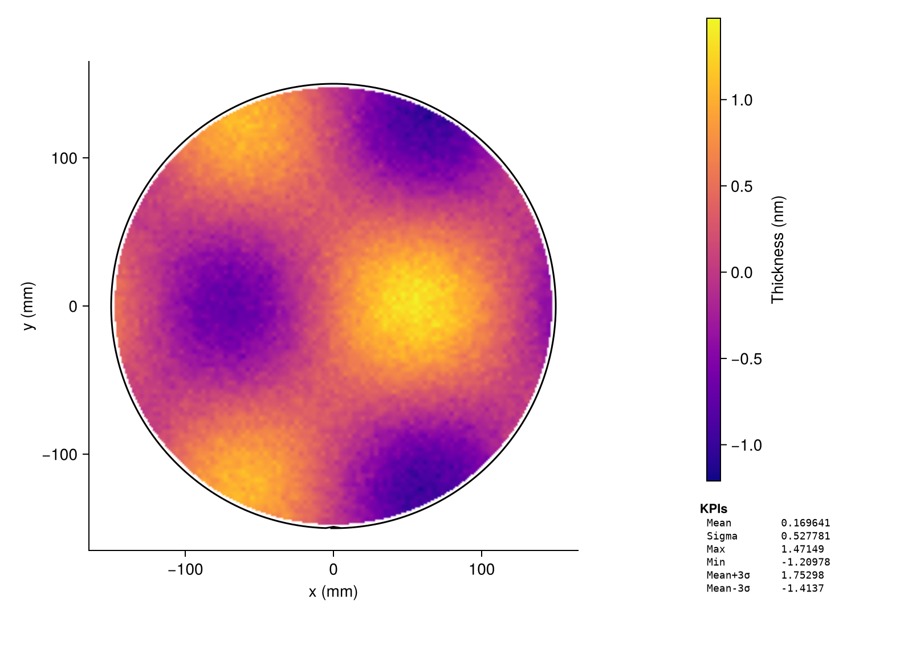
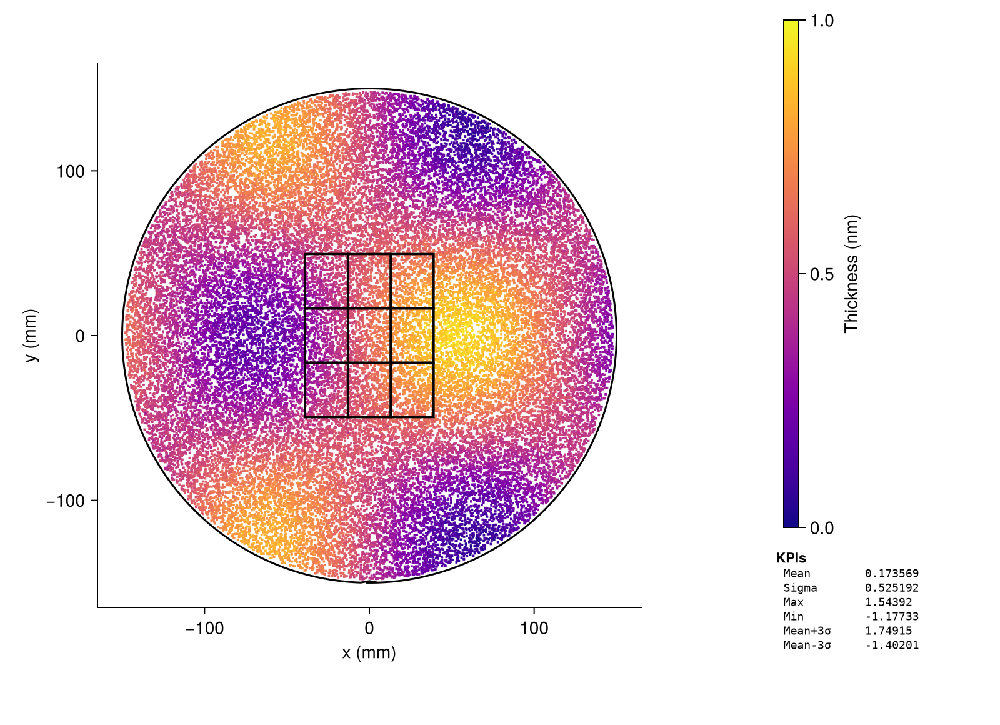
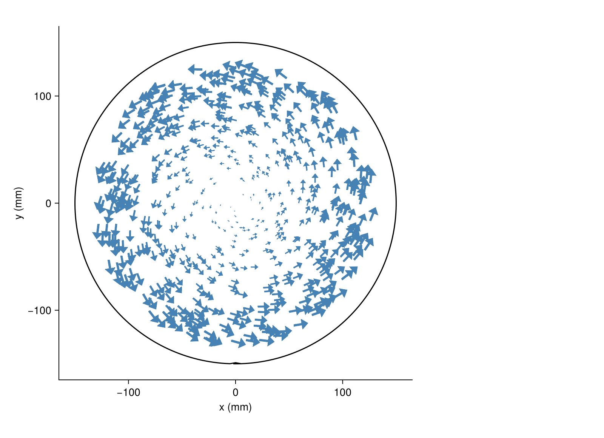
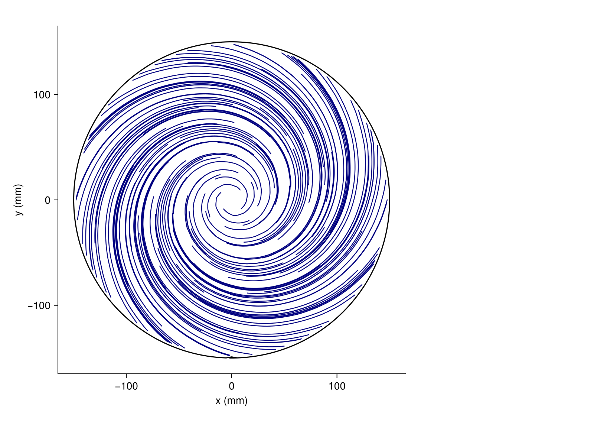

# Getting Started

## Installation

```julia
using Pkg
Pkg.add("LithoWaferPlots")
```

Add a Makie backend for rendering (GLMakie for desktop, WGLMakie for notebooks):

```julia
Pkg.add("GLMakie")
```

## Step 1 — Define the wafer

```julia
using LithoWaferPlots

wafer = WaferSpec()                # defaults to 300mm, notch at 270° (bottom)
wafer = WaferSpec(200.0, 0.0)      # 200mm, notch at 3 o'clock (0°, standard math angle)
```

## Step 2 — Load measurement data

### From a DataFrame (mm coordinates)

```julia
using DataFrames
df = DataFrame(x=meas_x, y=meas_y, value=meas_v)
data = WaferData(df, wafer)
```

### From die indices

```julia
grid = DieGrid(-75.0, -75.0, 5.0, 5.0)   # origin mm, die pitch mm
df = DataFrame(col=col_idx, row=row_idx, value=vals)
data = WaferData(df, grid, wafer)
```

### From plain arrays

```julia
data = WaferData((x=xs, y=ys, value=vs), wafer)
```

Rows with a non-finite `x`, `y`, or `value` (`NaN`/`Inf`) are dropped automatically at
construction, with a one-time warning — a bad measurement point can't silently corrupt an
entire colorbar or KPI.

## Step 3 — Plot

```julia
using GLMakie

fig, ax, side = wafer_figure()
p = waferheatmap!(ax, data)
add_colorbar!(side, p; label="Overlay (a.u.)")
add_kpi_panel!(side, data)
display(fig)
```

Any Makie attribute the underlying primitive supports (`marker`, `strokewidth`, `alpha`,
`linestyle`, `interpolate`, ...) can be passed straight through, e.g.
`waferscatter!(ax, data; marker=:diamond, alpha=0.7)` — no need to memorize a curated list.



## Step 4 — Add field overlays

Pass a `fields` vector when constructing `WaferData` to overlay rectangular
exposure fields on any plot type. [`field_grid`](@ref) builds the grid and drops fields
that don't overlap the wafer disk in one call:

```julia
centers = [((ci - 0.5) * 26.0, (ri - 5) * 33.0) for ri in 1:9, ci in -5:6]   # 12 × 9 grid
fields = field_grid(centers, (26.0, 33.0); wafer)

data = WaferData(df, wafer; fields=fields)
```



## Step 5 — Vector field plots

```julia
vdata = WaferVectorData(df, wafer)   # df has :x, :y, :vx, :vy columns

# Arrows
waferarrows!(ax, vdata; lengthscale=2.0)
```



```julia
# Streamlines
waferstreamlines!(ax, vdata; n_seeds=12, max_steps=80)
```



```julia
# Derived scalar fields
waferdivergence!(ax, vdata)
wafervorticity!(ax, vdata)
```

See the [Gallery](@ref) for divergence and vorticity examples.
